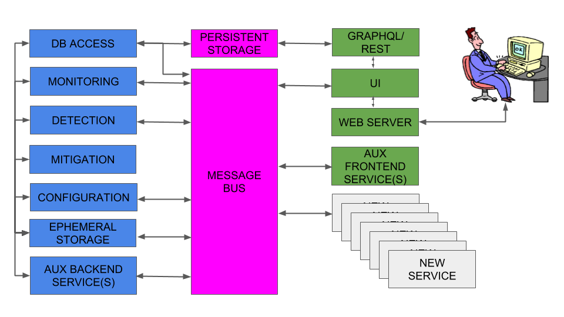

# ARTEMIS

Table of Contents
  * [General](#general)
  * [Features](#features)
  * [Architecture](#architecture)
  * [Getting Started](#getting-started)
  * [Min. technical requirements of testing server/VM](#min-technical-requirements-of-testing-servervm)
  * [How to install](#how-to-install)
  * [How to run](#how-to-run)
     * [Configuring the web application](#configuring-the-web-application)
     * [Starting ARTEMIS](#starting-artemis)
     * [Accessing ARTEMIS logs](#accessing-artemis-logs)
     * [Using the web application](#using-the-web-application)
     * [Registering users](#registering-users)
     * [Managing users (ADMIN-only)](#managing-users-admin-only)
     * [User account actions (ADMIN-VIEWER)](#user-account-actions-admin-viewer)
     * [Configuring and Controlling ARTEMIS through the web application (ADMIN-only)](#configuring-and-controlling-artemis-through-the-web-application-admin-only)
     * [Viewing ARTEMIS Configurations](#viewing-artemis-configurations)
     * [Viewing ARTEMIS state](#viewing-artemis-state)
     * [Viewing BGP updates](#viewing-bgp-updates)
     * [Viewing BGP hijacks](#viewing-bgp-hijacks)
     * [Actions on BGP hijacks (ADMIN-only)](#actions-on-bgp-hijacks-admin-only)
     * [CLI controls [optional]](#cli-controls-optional)
     * [Receiving BGP feed from local router/route reflector/BGP monitor via exaBGP](#receiving-bgp-feed-from-local-routerroute-reflectorbgp-monitor-via-exabgp)
     * [Backups](#backups)
     * [Migrating an existing DB to a new version](#migrating-an-existing-db-to-a-new-version)
     * [Exiting ARTEMIS](#exiting-artemis)
  * [Contributing](#contributing)
  * [Development](#development)
  * [Versioning](#versioning)
  * [Authors and Contributors](#authors-and-contributors)
  * [License](#license)
  * [Acknowledgements and Funding Sources](#acknowledgements-and-funding-sources)

## General

ARTEMIS is a defense approach versus BGP prefix hijacking attacks
(a) based on accurate and fast detection operated by the AS itself,
leveraging the pervasiveness of publicly available BGP monitoring
services and their recent shift towards real-time streaming,
thus (b) enabling flexible and fast mitigation of hijacking events.
Compared to existing approaches/tools, ARTEMIS combines characteristics
desirable to network operators such as comprehensiveness, accuracy, speed,
privacy, and flexibility. With the ARTEMIS approach, prefix hijacking
can be neutralized within a minute!

You can read more about ARTEMIS (and check e.g., news and related publications)
on the INSPIRE Group ARTEMIS [webpage](http://www.inspire.edu.gr/artemis).

This repository contains the software of ARTEMIS as a tool.
ARTEMIS can be run on a testing server/VM as a modular (and extensible)
multi-container application.

## Features

For a detailed list of supported features please check the [CHANGELOG](CHANGELOG.md) file
(section: "Added"). On a high level, the following main features are supported:

* Real-time monitoring of the changes in the BGP routes of the network's prefixes.
* Real-time detection and notifications of BGP prefix hijacking attacks/events of the following types:
exact-prefix type-0/1, sub-prefix of any type, and squatting attacks.
* Automatic/custom tagging of detected BGP hijack events (ongoing, resolved, ignored, under mitigation, withdrawn and outdated).
* Manual or manually controlled mitigation of BGP prefix hijacking attacks.
* Comprehensive web interface.
* Configuration file editable by the operator (directly or via the web interface),
containing information about: prefixes, ASNs, monitors and ARTEMIS rules ("ASX originates prefix P and advertises it to ASY").
* Support for both IPv4 and IPv6 prefixes.
* Modularity/extensibility by design.

## System Architecture



The philosophy behind the ARTEMIS architecture is the use of a message bus (MBUS) in its core,
used for routing messages (RPC, pub/sub, etc.) between different processes/services
and containers, using the kombu framework (https://github.com/celery/kombu) to interface
between rabbitmq and the message senders/receivers (e.g., consumers). The controller/supervisor
service is responsible for checking the status of the other backend services.
In a nutshell, there are 6 basic modules:
* Configuration
* Monitoring
* Detection
* Mitigation
* DB access/management
* Clock
* Observer
* User interface

The operator (i.e., the “user”) interfaces with the system by filling in a configuration file
and by interacting with the web application (UI) to control the various modules and
see useful information related to monitoring entries and detected hijacks (including their
current status). Configuration is imported in all modules since it is used for monitor
filtering, detection tuning, mitigation configuration and other functions. The feed from
the monitoring module (which can stem from multiple BGP monitoring sources around the world,
including local monitors) is validated and transmitted to the detection and db access modules.
The detection module reasons about whether what it sees is a hijack or not; if it is, it
generates a hijack entry which is in turn stored in the DB, together with the corresponding
monitoring entries. Finally, using a web application, the operator can instruct the mitigation
module to mitigate a hijack or mark it as resolved/ignored. All information is persistently
stored in the DB, which is accessed by the web application (user interface).
Clock and observer modules are auxiliary, and take care of periodic clock signaling and configuration
change notifications, respectively.

## Getting Started

ARTEMIS is built as a multi-container Docker application.
The following instructions will get you a containerized
copy of the ARTEMIS tool up and running on your local machine
for testing purposes. For instructions on how to set up ARTEMIS
in e.g., a Kubernetes environment, please contact the ARTEMIS team.

## Min. technical requirements of testing server/VM

* CPU: 4 cores
* RAM: 4 GB
* HDD: 100 GB (less may suffice, depending on the use case)
* NETWORK: 1 public-facing network interface
* OS: Ubuntu Linux 16.04+
* SW PACKAGES: docker-ce and docker-compose should be pre-installed (see instructions later)
and docker should have sudo privileges, if only non-sudo user is allowed
* Other: SSH server

Moreover, one may optionally configure firewall rules related to the testing server/VM.
We recommend using [ufw](https://www.digitalocean.com/community/tutorials/how-to-set-up-a-firewall-with-ufw-on-ubuntu-16-04)
for this task. Please check the comments in the respective script we provide and
set the corresponding <> fields in the file before running:
```
sudo ./other/ufw_setup.sh
```

## How to install

Make sure that your Ubuntu package sources are up-to-date:
```
sudo apt-get update
```

If not already installed, follow the instructions
[here](https://docs.docker.com/install/linux/docker-ce/ubuntu/#install-docker-ce)
to install the latest version of the docker tool for managing containers,
and [here](https://docs.docker.com/compose/install/#install-compose)
to install the docker-compose tool for supporting multi-container Docker applications.

If you would like to run docker without using sudo, please create
a docker group, if not existing:
```
sudo groupadd docker
```
and then add the user to the docker group:
```
sudo usermod -aG docker $USER
```
For more instructions and potential debugging on this please consult this
[webpage](https://docs.docker.com/install/linux/linux-postinstall/#manage-docker-as-a-non-root-user).

Install ntp for time synchronization:
```
sudo apt-get install ntp
```

Install git for downloading ARTEMIS:
```
sudo apt-get install git
```
and then download ARTEMIS from github (if not already downloaded).

Note that while the backend and frontend code is available in the repository,
docker-compose is configured to pull the latest images that are built remotely
on [docker cloud](https://cloud.docker.com/)(TBD). 
In any case, you can build ARTEMIS locally by running:
```
docker-compose -f docker.compose.yaml -f docker_compose.<extra_service>.yaml build
```
after you have entered the root folder of the cloned ARTEMIS repo. Note that extra services are
currently the following (it is optional to use them):
* exabgp: local exaBGP monitor
* grafana: alternative UI (currently not in use)
* migrate: for migration of already existing DBs in production deployments
* pgadmin: UI for database management
* syslog: additional syslog container for collecting ARTEMIS logs
* test: test container (under development)

## How to run

### Configuring the web application
Before starting ARTEMIS, you should configure access to the web application
(used to configure/control ARTEMIS and view its state),
by editing the following file:
```
docker-compose.yaml
```
and adjusting the following parameters/environment variables related
to the artemis_frontend in .env:
```
ADMIN_USER=admin
ADMIN_PASS=admin123
ADMIN_EMAIL=admin@admin
```
and modifying the secret key for your own deployment:
```
JWT_SECRET_KEY
```
The ARTEMIS web application supports https to ensure secure access to the application.
We use a nginx reverse proxy to terminate SSL connections before forwarding the requests
to Flask. To configure your own (e.g., self-signed) certificates, please place in the following folder:
```
frontend/webapp/configs/certs
```
the following files:
```
cert.pem
key.pem
```
If you want to use e.g., "let's encrypt" certificates you can configure the nginx configuration files
detailed below.
If you require selective access to the UI from certain IP ranges, please adjust and comment out
the nginx ACL-related lines in:
```
frontend/webapp/configs/nginx.conf
```
You do not need to modify any other configuration files and variables for now.

### Starting ARTEMIS
You can now start ARTEMIS as a multi-container application
by running:
```
docker-compose -f docker.compose.yaml -f docker_compose.<extra_service>.yaml up -d
```
in detached mode (to run it as a daemon; recommended mode).

### Accessing ARTEMIS logs
Logs can be accessed as follows:
```
docker-compose logs
```
If you need the logs from a particular running container, e.g., the backend, do the following:
```
docker-compose exec backend bash
cd /var/logs/artemis
```

### Using the web application
Visually, you can now configure, control and view ARTEMIS by logging in to https://<ARTEMIS_HOST>/login.
The default ADMIN user can login with the credentials set in the .env variables.

### Registering users
```
https://<ARTEMIS_HOST>/create_account
```
Here you can input your credentials and request a new account. The new account has to be approved
by an ADMIN user. The default role for new users is VIEWER.

### Managing users (ADMIN-only)
```
https://<ARTEMIS_HOST>/admin/user_management
```
Here the ADMIN user can approve pending users,
promote users to admins, delete users and view all users.
An ADMIN can delete VIEWER users, but not ADMIN users (TBD).

### User account actions (ADMIN-VIEWER)
Currently the current account-specific actions are supported:
* Password change at:
```
https://<ARTEMIS_HOST>/actions/password_change
```

### Configuring and Controlling ARTEMIS through the web application (ADMIN-only)
```
https://<ARTEMIS_HOST>/admin/system
```
Here the ADMIN may switch the Monitor, Detection and Mitigation modules of ARTEMIS on and off,
as well as edit the configuration. The configuration file has the following (yaml) format:
```
#
# ARTEMIS Configuration File
#

# Start of Prefix Definitions
prefixes:
  <prefix_group_1>: &prefix_group_1
    - <prefix_1>
    - <prefix_2>
    - ...
    - <prefix_N>
  ...: &...
    - ...
# End of Prefix Definitions

# Start of Monitor Definitions
monitors:
  riperis: ['']
  bgpstreamlive:
    - routeviews
    - ris
  betabmp: betabmp
  exabgp:
    - ip: <IP_1>
      port: <PORT_1>
    - ip: ...
      port: ...
  bgpstreamhist: <path_to_csv_dir>
# End of Monitor Definitions

# Start of ASN Definitions
asns:
  <asn_group_1>: &asn_group_1
    - <asn_1>
    - ...
    - <asn_N>
  ...: &...
    - ...
    - ...
# End of ASN Definitions

# Start of Rule Definitions
rules:
- prefixes:
  - *<prefix_group_k>
  - *...
  origin_asns:
  - *<asn_group_j>
  - *...
  neighbors:
  - *<asn_group_l>
  - *...
  mitigation:
    manual
- ...
# End of Rule Definitions
```
Optionally the user can accompany the configuration with comments.

### Viewing ARTEMIS Configurations
```
https://<ARTEMIS_HOST>/admin/config_comparison
```
Here the user (ADMIN|VIEWER) can view the ARTEMIS configuration history and diffs, as well as the (optional) comments attached to each configuration. Since configuration changes are atomic operations, the different configurations are keyed with their modification timestamp.

### Viewing ARTEMIS state
After being successfully logged-in to ARTEMIS, you will be redirected to the following webpage:
```
https://<ARTEMIS_HOST>/overview
```
Here you can view info about:
* your last login information (email address, time and IP address)
* the system status (status of modules and uptime information)
* most recent ongoing BGP hijacks related to your network's prefixes
* the ARTEMIS version you are running
* statistics about the ARTEMIS db, in particular:
** Total number of BGP updates, as well as of unhandled (by the detection module) updates
** Total number of detected BGP hijacks (as well as a break-down in "resolved",
"under mitigation", "ongoing", "withdrawn", "outdated", "ignored" and "seen").

Please use the embedded mouse-hover info for more information on the fields.

### Viewing BGP updates
All BGP updates captured by the monitoring system in real-time can be seen here:
```
https://<ARTEMIS_HOST>/main/bgpupdates/
```
The following fields are supported:
* Prefix (IPv4/IPv6)
* Origin AS
* AS Path (only for BGP announcements)
* Peer AS (from where the information was learned)
* Service, in the format <data_source>--><collector_name>
* Type (A|W - Announcement|Withdrawal)
* Timestamp (displayed in local time zone)
* Hijack (if present, redirects to a corresponding Hijack entry)
* Status (blue if the detector has seen the update and the update is handled, grey if examination is pending)
* Additional information: Communities ([...:...,...])
* Additional information: Original Path (if the original path e.g., contains AS-SETs, etc.)
* Additional information: Hijack Key (unique hijack identifier)
* Additional information: Matched prefix (according to the configuration file)
* Additional information: View Hijack (hyperlink to the related hijack, if applicable)

Please use the embedded mouse-hover info for more information on the fields.

### Viewing BGP hijacks
All BGP hijacks detected by the detection system in real-time can be seen here:
```
https://<ARTEMIS_HOST>/main/hijacks/
```
The following fields are supported:
* Status (ongoing|under mitigation|ignored|resolved|withdrawn|outdated)
* Prefix (IPv4/IPv6)
* Type (S - Subprefix|Q - Squatting|0 - Origin|1 - fake first hop)
* Hijack AS
* Number of Peers Seen (the ones that have seen the event)
* Number of ASes Infected (the ones that seemingly route to the hijacker)
* Time Detected (timestamp of the system time queried when the hijack was detected by the detection module).
* Time Ended (this is set only for resolved or withdrawn hijacks)
* Time Last Updated
* Mitigation Started (this is set for hijacks under mitigation)
* Matched Prefix (the prefix that best matched configuration, if applicable)
* Config Matched (the timestamp of the configuration against which the hijack was generated)
* Key (unique hijack key)
* Comment text

Note that after the details of a hijack, you can also see details on the BGP updates that triggered it.

Please use the embedded mouse-hover info for more information on the fields.

### Actions on BGP hijacks (ADMIN-only)
The ADMIN user can use the following buttons:
* Resolve: The hijack has finished (by successful mitigation or other actions). It marks the Time Ended
field and sets an ongoing or under mitigation hijack to resolved state.
* Mitigate: Start the mitigation process for this hijack. It sets the Mitigation Started field and sets an ongoing
hijack to under mitigation state. Note that the mitigation module should be active for this to work.
* Ignore: the hijack is a false positive. It sets an ongoing or under mitigation hijack to ignored state.
* Acknowledge: mark the hijack as seen.

Note that only the following state transitions are enabled:
* ongoing (--> under mitigation) (--> outdated) --> resolved
* ongoing (--> under mitigation) (--> outdated) --> ignored
* ongoing (--> under mitigation) (--> outdated) --> withdrawn

The VIEWER use can see the status of a hijack but cannot activate any buttons.

### CLI controls [optional]
You can also control ARTEMIS (if required) via a CLI, by executing the following command(s):
```
docker-compose exec backend bash
supervisorctl
```
Note that module = configuration|clock|postgresql_db|monitor|detection|observer|mitigation,
and action=start|stop|status.

Also note that the web application (frontend) and the backend operate in their own separate containers; 
to e.g., restart them separately, please run the following command:
```
docker-compose restart frontend
docker-compose restart backend
```

### Receiving BGP feed from local router/route reflector/BGP monitor via exaBGP
First, comment out all exabgp-related lines in the docker-compose.yaml file.

Then, edit the backend/configs/exabgp.conf file as follows:
```
group r1 {
    router-id <PUBLIC_IP>;

    process message-logger {
        encoder json;
        receive {
            parsed;
            update;
            neighbor-changes;
        }
        run /usr/lib/python2.7.14/bin/python /home/server.py;
    }

    neighbor <NEIGHBOR_IP> {
        local-address <LOCAL_LAN_IP>;
        local-as <LOCAL_ASN>;
        peer-as <PEER_ASN>;
    }
}
```

Stop, rebuild and restart ARTEMIS:
```
docker-compose -f ... down
docker-compose -f ... -f docker-compose.exabgp.yaml up -d
```

Login and configure the monitor using the web application form in
```
https://<ARTEMIS_HOST>/admin/system
```
by setting its IP address and port. An example is the following:
```
...
monitors:
  ...
  exabgp:
    - ip: exabgp # this will automatically be resolved to the exabgp container's IP
      port: 5000
...
```
*NOTE*: We strongly recommend the use of eBGP instead of iBGP sessions between the
exaBGP monitor and the local router(s).

### Backups
After booting ARTEMIS, please execute the following commands on the postgres container:
```
docker-compose exec postgres bash
crond
exit
```
The DB will then be regularly backed up (daily) in folder postgres-data-backup.

### Migrating an existing DB to a new version
While developing ARTEMIS, we may change also the DB schema. 
To migrate to a new DB state, please
execute the following commands:
```
docker-compose -f ... down
git pull origin master
docker-compose -f docker-compose.migrate.yaml up
Ctrl+C
docker-compose -f ... up -d
```
If everything went correctly, you will see that the migration process was successful.

### Exiting ARTEMIS

Note that to gracefully terminate ARTEMIS and all its services you can use the following command:
```
docker-compose -f ... down
```

## Contributing
Please check [this file](CONTRIBUTING.md).

## Development
We follow a custom Agile approach for our development.

## Versioning
Please check [this file](CHANGELOG.md).

## Authors and Contributors
Please check [this file](AUTHORS.md).

## License
The ARTEMIS software is open-sourced under the BSD-3 license.
Please check the [license file](LICENSE).
All external dependencies are used in a way compatible with BSD-3;
the software packages and their respective licenses are documented
in detail in [this file](DEPENDENCIES-LICENSES.md).

## Acknowledgements and Funding Sources
Please check [this file](ACKS.md).
