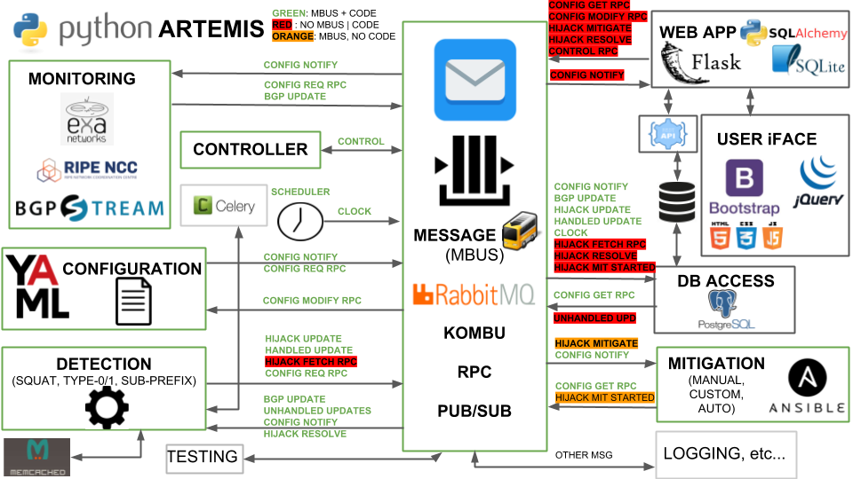

# ARTEMIS

## The Tool

ARTEMIS is a defense approach versus BGP prefix hijacking attacks (a) based on accurate and fast detection operated by the AS itself, leveraging the pervasiveness of publicly available BGP monitoring services and their recent shift towards real-time streaming, thus (b) enabling flexible and fast mitigation of hijacking events. Compared to existing approaches/tools, ARTEMIS combines characteristics desirable to network operators such as comprehensiveness, accuracy, speed, privacy, and flexibility. With the ARTEMIS approach, prefix hijacking can be neutralized within a minute!

You can read more on INSPIRE Group ARTEMIS webpage: http://www.inspire.edu.gr/artemis.

## Features

The current version of ARTEMIS as a tool includes the following features:

* Real-time monitoring of the inter-domain routing control plane using feed from BGP route collectors via [RIPE RIS](http://stream-dev.ris.ripe.net/demo), [BGPStream](https://bgpstream.caida.org/) (RouteViews + RIPE RIS) and [exaBGP](https://github.com/Exa-Networks/exabgp) (local monitor) interfaces.
* Detection of basic types of BGP prefix hijacking attacks/events, i.e., exact-prefix type-0/1, sub-prefix of any type, and squatting attacks.
* Manual mitigation of BGP prefix hijacking attacks.
* User interface to configure the tool, have an overview of the inter-domain control plane state related to the IP prefixes of interest, and get notified about BGP hijacks against the prefixes of the network which is running ARTEMIS.
* Support for both IPv4 and IPv6 prefixes.
* Modularity/extensibility by design.

*Note*: All current development is taking place on the kombu branch, which is a significant refactoring of the tool's code. The master branch will be up-to-date by September the 13th, 2018.

## Architecture (current)



## Getting Started

ARTEMIS is built as a multi-container Docker application. The following instructions will get you a containerized copy of the ARTEMIS tool up and running on your local machine for testing purposes.

## Technical requirements of testing server/VM (TBD)

* CPU: ...
* RAM: ...
* HDD: ...
* NETWORK: ...
* OS: Ubuntu Linux 16.04+

## How to run

First, if not already installed, follow the instructions [here](https://docs.docker.com/install/linux/docker-ce/ubuntu/#install-docker-ce) to install the latest version of 
the docker tool for managing containers, and [here](https://docs.docker.com/compose/install/#install-compose) to install the docker-compose tool for supporting multi-container Docker applications.

If you would like to run docker without using sudo, please add the local user to the default docker group:
```
sudo usermod -aG docker $USER
```

If you do not have access to the inspiregroup/artemis-tool image you can build your own by running:

```
docker-compose build
```
after you have entered the root folder of the cloned artermis repo.

Otherwise, you can simply pull the latest build from dockerhub (TBD):
```
docker login
docker pull inspiregroup/artemis-tool
```

Before starting ARTEMIS, you can configure the web application (used to configure ARTEMIS and view its state), by editing the following file (TBD):
```
TBD
```

You can start ARTEMIS as a multi-container application by running:
```
docker-compose up
```

You can control ARTEMIS (if required) via a CLI, by executing the following command(s):
```
docker exec -it artemis python3 scripts/module_control.py -m <module> -a <action>
```
Note that module = 'all'|''configuration'|'scheduler'|'postgresql_db'|'monitor'|'detection'|'mitigation', and action='start'|'stop'|'status'

Visually, you can now configure, control and view ARTEMIS on <WEBAPP_HOST>:<WEBAPP_PORT> (TBD).

Note that to gracefully terminate ARTEMIS and all its services you can use the following commands:

```
Ctrl+C # on the terminal running ARTEMIS
docker-compose down # afterwards, same terminal
```

## SSL/TLS Support

The following process, based on Flask-accessed certificates/keys, is to be used only termporarily in testing environments.

In production, a scalable nginx/apache-based reverse proxy will be used to terminate SSL connections (TBD).

For testing, simply configure the following in the webapp configuration file (TBD):
```
WEBAPP_KEY = '<path_to_key_file>'
WEBAPP_CRT = '<path_to_cert_file>'
```

## Known Issues

1. iptables: No chain/target/match by that name
```
docker: Error response from daemon: driver failed programming external connectivity on endpoint artemistest (4980f6b7fe169a16e8ebe5f5e01a31700409d17258da0ee19ea060060d3f3db9):  (iptables failed: iptables --wait -t filter -A DOCKER ! -i docker0 -o docker0 -p tcp -d 172.17.0.2 --dport 5000 -j ACCEPT: iptables: No chain/target/match by that name.
 (exit status 1)).
```

To fix, clear all chains and then restart Docker Service:
```
iptables -t filter -F
iptables -t filter -X
systemctl restart docker
```

## Contributing

### Implementing additional Monitors (taps)
```
TBD
```

For example take a look at the `backend/taps/exabgp_client.py` which implements the exaBGP monitor publisher or `backend/taps/ripe_ris.js` which implements the RIPE RIS monitor publisher. Please edit only the code in the taps folder.

## Versioning
TBD (for now working on the bleeding edge of the master branch, version tags to-be-released)

## Authors
* Dimitrios Mavrommatis, FORTH-ICS
* Petros Gigis, FORTH-ICS
* Vasileios Kotronis, FORTH-ICS

## License
TBD (closed source until further notice; considering BSD-3 license but not definitive yet)

## Acknowledgements
This work is supported by the following sources:
* European Research Council (ERC) grant agreement no. 338402 (NetVolution Project)
* RIPE NCC Community Projects Fund
