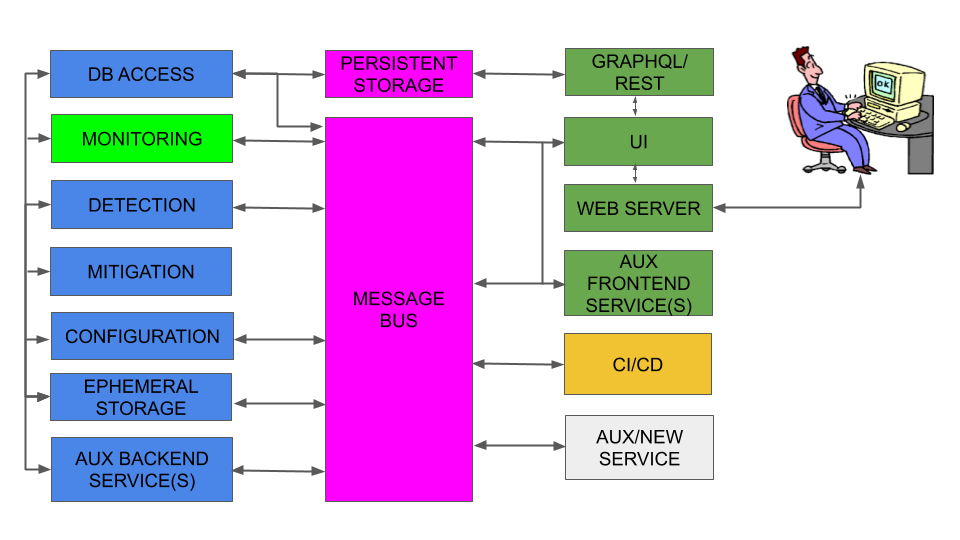

# ARTEMIS

Table of Contents
  * [General](#general)
  * [Features](#features)
  * [Architecture](#architecture)
  * [Getting Started](#getting-started)
  * [Minimum Technical Requirements](#minimum-technical-requirements)
  * [How to Install](#how-to-install)
  * [How to Run](#how-to-run)
  * [Contributing](#contributing)
  * [Development Team and Contact](#development-team-and-contact)
  * [Versioning](#versioning)
  * [Authors and Contributors](#authors-and-contributors)
  * [License](#license)
  * [Acknowledgements and Funding Sources](#acknowledgements-and-funding-sources)
  * [Powered By](#powered-by)

## General

ARTEMIS is a defense approach versus BGP prefix hijacking attacks
(a) based on accurate and fast detection operated by the AS itself,
leveraging the pervasiveness of publicly available BGP monitoring
services and their recent shift towards real-time streaming,
thus (b) enabling flexible and fast mitigation of hijacking events.
Compared to existing approaches/tools, ARTEMIS combines characteristics
desirable to network operators such as comprehensiveness, accuracy, speed,
privacy, and flexibility. With the ARTEMIS approach, prefix hijacking
can be neutralized within a minute!

You can read more about ARTEMIS (and check e.g., news, presentations and related publications)
on the INSPIRE Group ARTEMIS [webpage](http://www.inspire.edu.gr/artemis).

This repository contains the software of ARTEMIS as a tool.
ARTEMIS can be run on a testing server/VM as a modular (and extensible)
multi-container application. Up to today it has been tested at a major 
greek ISP, a dual-homed edge academic network (our home institutional network),
and a major R&E US backbone network.

## Features

For a detailed list of supported features please check the [CHANGELOG](CHANGELOG.md) file
(section: "Added"). On a high level, the following main features are supported:

* Real-time monitoring of the changes in the BGP routes of the network's prefixes.
* Real-time detection and notifications of BGP prefix hijacking attacks/events of the following types:
exact-prefix type-0/1, sub-prefix of any type, and squatting attacks.
* Automatic/custom tagging of detected BGP hijack events (ongoing, resolved, ignored, under mitigation, withdrawn and outdated).
* Manual or manually controlled mitigation of BGP prefix hijacking attacks.
* Comprehensive web interface.
* Configuration file editable by the operator (directly or via the web interface),
containing information about: prefixes, ASNs, monitors and ARTEMIS rules ("ASX originates prefix P and advertises it to ASY").
* Support for both IPv4 and IPv6 prefixes.
* Modularity/extensibility by design.

## System Architecture



## Getting Started

ARTEMIS is built as a multi-container Docker application.
The following instructions will get you a containerized
copy of the ARTEMIS tool up and running on your local machine
for testing purposes. For instructions on how to set up ARTEMIS
in e.g., a Kubernetes environment, please contact the [ARTEMIS team](#development-team-and-contact).

## Minimum Technical Requirements

* 1 testing server/VM
* CPU: 4 cores
* RAM: 4 GB
* HDD: 100 GB (less may suffice, depending on the use case)
* NETWORK: 1 public-facing network interface
* OS: Ubuntu Linux 16.04+
* SW PACKAGES: docker-ce and docker-compose should be pre-installed (see instructions later)
and docker should have sudo privileges, if only non-sudo user is allowed
* Other: SSH server

Moreover, one may optionally configure firewall rules related to the testing server/VM.
We recommend using [ufw](https://www.digitalocean.com/community/tutorials/how-to-set-up-a-firewall-with-ufw-on-ubuntu-16-04)
for this task. Please check the comments in the respective script we provide and
set the corresponding <> fields in the file before running:
```
sudo ./other/ufw_setup.sh
```
**NOTE: For security reasons, we highly recommend protecting your machine with such rules.**

## How to Install

Make sure that your Ubuntu package sources are up-to-date:
```
sudo apt-get update
```

If not already installed, follow the instructions
[here](https://docs.docker.com/install/linux/docker-ce/ubuntu/#install-docker-ce)
to install the latest version of the docker tool for managing containers,
and [here](https://docs.docker.com/compose/install/#install-compose)
to install the docker-compose tool for supporting multi-container Docker applications.

If you would like to run docker without using sudo, please create
a docker group, if not existing:
```
sudo groupadd docker
```
and then add the user to the docker group:
```
sudo usermod -aG docker $USER
```
For more instructions and potential debugging on this please consult this
[webpage](https://docs.docker.com/install/linux/linux-postinstall/#manage-docker-as-a-non-root-user).

Install ntp for time synchronization:
```
sudo apt-get install ntp
```

Install git for downloading ARTEMIS:
```
sudo apt-get install git
```
and then download ARTEMIS from github (if not already downloaded).

Note that while the backend and frontend code is available in the repository,
docker-compose is configured to pull the latest images that are built remotely
on [docker cloud](https://cloud.docker.com/)(TBD). 
In any case, you can build ARTEMIS locally by running:
```
docker-compose -f docker.compose.yaml -f docker_compose.<extra_service>.yaml build
```
after you have entered the root folder of the cloned ARTEMIS repo. Note that extra services are
currently the following (it is optional to use them):
* exabgp: local exaBGP monitor
* migrate: for migration of already existing DBs in production deployments

## How to Configure and Run

Please check our [wiki](https://github.com/FORTH-ICS-INSPIRE/artemis/wiki).

There, you will find information on the following topics (more to come):
* The basic logic of ARTEMIS
* Configuring the web application
* Starting ARTEMIS
* Configuring logging and accessing ARTEMIS logs
* Using the web application
* Registering users
* Managing users (ADMIN-only)
* User account actions (ADMIN-VIEWER)
* Configuring and Controlling ARTEMIS through the web application (ADMIN-only)
* Viewing ARTEMIS Configurations
* Viewing ARTEMIS state
* Viewing BGP updates
* Viewing BGP hijacks
* Actions on BGP hijacks (ADMIN-only)
* CLI controls [optional]
* Receiving BGP feed from local router/route reflector/BGP monitor via exaBGP
* Configuring backups
* Migrating an existing DB to a new version
* Exiting ARTEMIS

**Note: We highly recommend going through the wiki instructions before using ARTEMIS for the first time.**

## Contributing
Please check [this file](CONTRIBUTING.md).

## Development Team and Contact
We follow a custom Agile approach for our development.

You can contact the ARTEMIS developers as follows:
* Dimitrios Mavrommatis (backend): mavromat_at_ics_dot_forth_dot_gr
* Petros Gigis (frontend): gkigkis_at_ics_dot_forth_dot_gr
* Vasileios Kotronis (coordinator): vkotronis_at_ics_dot_forth_dot_gr

## Versioning
Please check [this file](CHANGELOG.md).

## Authors and Contributors
Please check [this file](AUTHORS.md).

## License
The ARTEMIS software is open-sourced under the BSD-3 license.
Please check the [license file](LICENSE).

Note that all external dependencies are used in a way compatible with BSD-3
(that is, we obey the compatibility rules of each and every dependency);
the associated software packages and their respective licenses are documented
in detail in [this file](DEPENDENCIES-LICENSES.md), where we provide links
to their homepages and licenses.

## Acknowledgements and Funding Sources
Please check [this file](ACKS.md).

## Powered By
<p align="center">


</p>

*DISCLAIMER: We do not own these images. All links to the respective project pages
from where the logos were downloaded are contained in [this file](DEPENDENCIES-LICENSES.md),
together with the respective licenses. The sole purpose of this section is to thank the
open-source projects that enabled ARTEMIS with their APIs by making them as visible as possible.
The list of project logos is not exhaustive. Image copyrights are retained by the respective project(s).*
