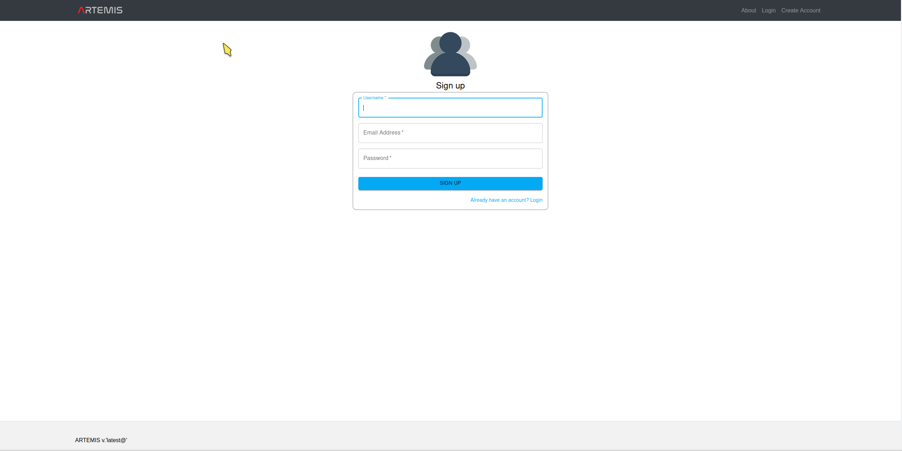
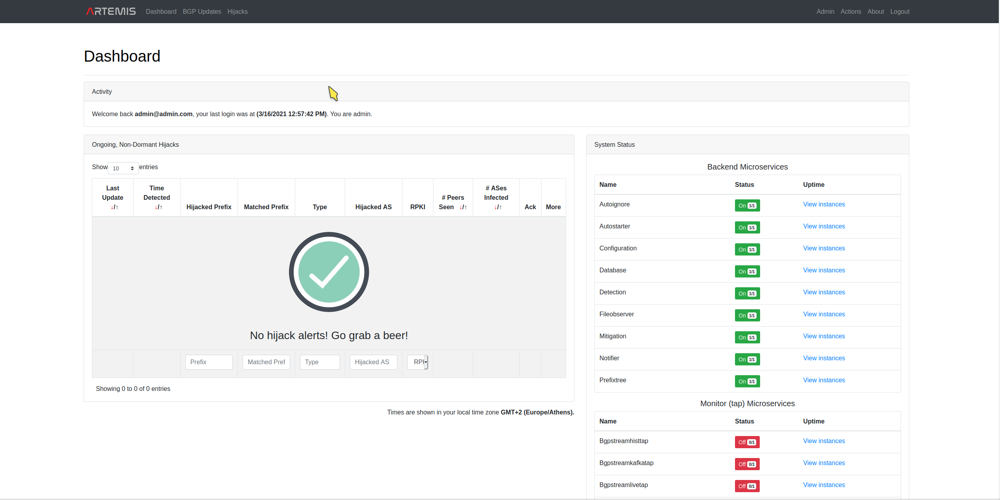
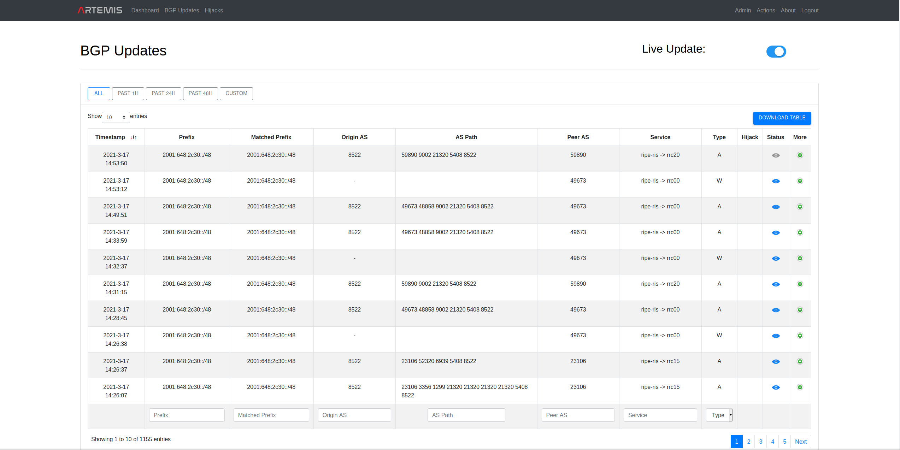
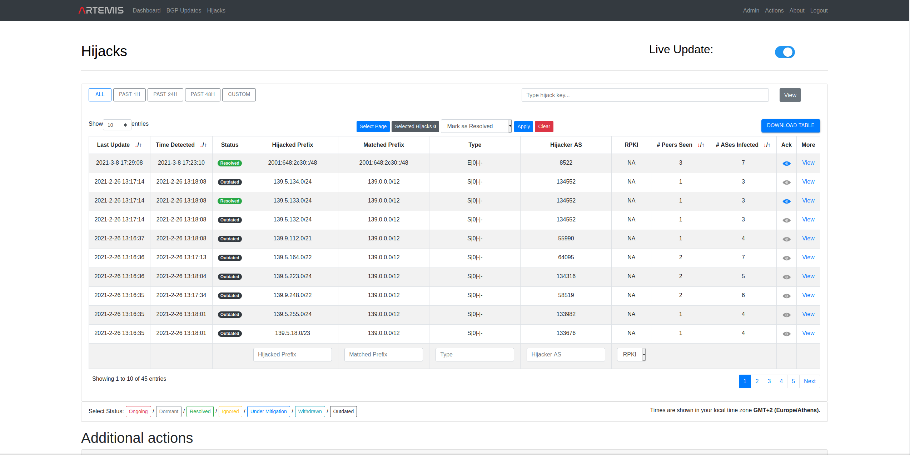
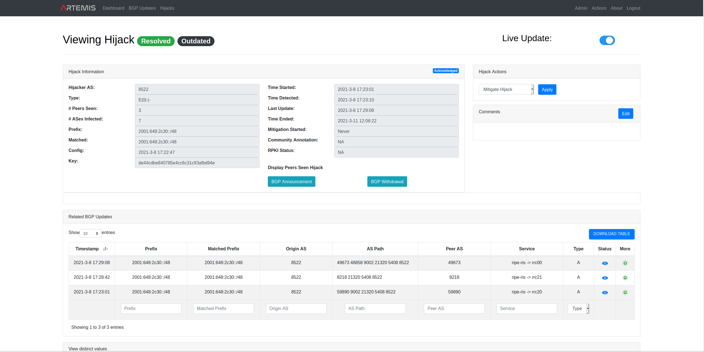
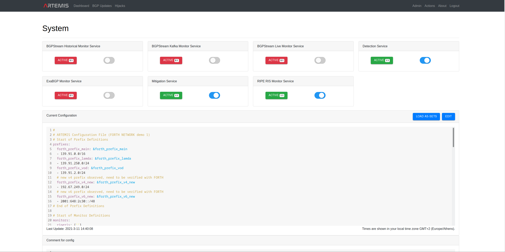
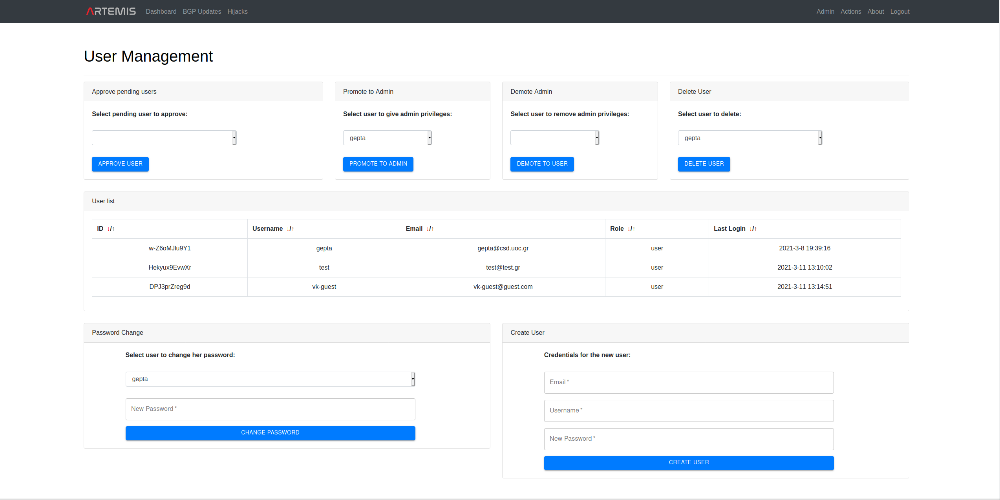
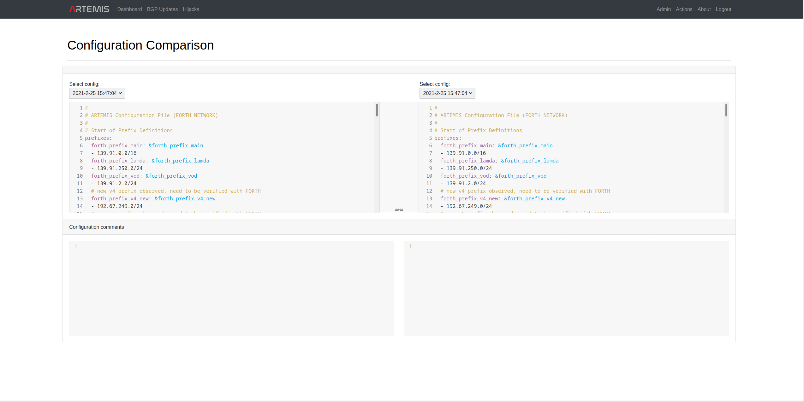
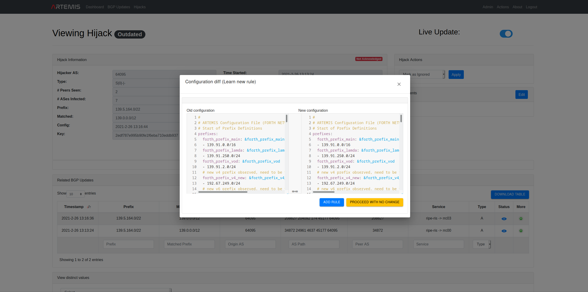

# Using the Web Application

Visually, you can now configure, control and view ARTEMIS by logging in to
`https://<ARTEMIS_HOST>/login`.
The default `ADMIN` user can login with the credentials set in the `.env` variables.

We recommend that you use the latest version of Chrome for the best ARTEMIS experience.

## User authentication API

Please download and render the HTML file from [here](https://github.com/FORTH-ICS-INSPIRE/artemis/tree/master/docs/api-documentation.html).
This is the documentation of the Artemis REST API accessible to normal users. The respective `swagger.json` OpenAPI spec can be found [here](https://github.com/FORTH-ICS-INSPIRE/artemis/tree/master/docs/swagger.json).

## Registering users

```
https://<ARTEMIS_HOST>/signup
```

Here you can input your credentials and request a new account. The new account has to be approved
by an ADMIN user. The default role for new users is VIEWER.

## Managing users

```
https://<ARTEMIS_HOST>/admin/user_management
```

Here the ADMIN user can create new users, approve pending users,
promote users to admins, demote users from admins,
delete users, view all users and change their password.
An ADMIN can delete VIEWER users, but not ADMIN users
(these need to be demoted first; except for the root admin
user who can never be demoted and thus deleted for availability
reasons).

## User account actions (ADMIN-VIEWER)

Currently the current account-specific actions are supported:

- Password change at:

```
https://<ARTEMIS_HOST>/password_change
```

## Configuring and Controlling ARTEMIS through the web application

```
https://<ARTEMIS_HOST>/admin/system
```

Here the ADMIN may switch the Monitoring, Detection and Mitigation microservices of ARTEMIS on and off,
as well as edit the configuration. The configuration file has the following (yaml) format (**please check
[this page](https://bgpartemis.readthedocs.io/en/latest/basicconf/) for details on the different sections**; note that reserved words are marked in bold):

```
#
## ARTEMIS Configuration File
#
#
## Start of Prefix Definitions
prefixes:
  <prefix_group_1>: &prefix_group_1
    - <prefix_1>
    - <prefix_2>
    - ...
    - <prefix_N>
  ...: &...
    - ...
## End of Prefix Definitions
#
## Start of Monitor Definitions
monitors:
  riperis: ['']
  bgpstreamlive:
      - routeviews
      - ris
  exabgp:
      - ip: <IP_1>
        port: <PORT_1>
  #     - ip: ...
  #       port: ...
  # bgpstreamhist: <path_to_csv_dir>
## End of Monitor Definitions
#
## Start of ASN Definitions
asns:
  <asn_group_1>: &asn_group_1
    - <asn_1>
    - ...
    - <asn_N>
  ...: &...
    - ...
    - ...
## End of ASN Definitions
#
## Start of Rule Definitions
rules:
- prefixes:
  - *<prefix_group_k>
  - *...
  origin_asns:
  - *<asn_group_j>
  - *...
  neighbors:
  - *<asn_group_l>
  - *...
  mitigation:
    manual
- ...
## End of Rule Definitions
```

Optionally the user can accompany the configuration with comments.

Note that the colors of the controllable microservices are as follows:

- red: the microservice is off (due to administrative action).
- green: the microservice is up and running, ready to operate.

## Viewing ARTEMIS Configurations

```
https://<ARTEMIS_HOST>/config_comparison
```

Here the user (ADMIN|VIEWER) can view the ARTEMIS configuration history and diffs, as well as the (optional) comments attached to each configuration. Since configuration changes are atomic operations, the different configurations are keyed with their modification timestamp.

## Viewing ARTEMIS state

After being successfully logged-in to ARTEMIS, you will be redirected to the following webpage:

```
https://<ARTEMIS_HOST>/dashboard
```

Here you can view info about:

- your last login information (email address, time and IP address)
- the system status (status of microservices and uptime information). In particular, colors mean the following:
  - red: the microservice is off (due to administrative action or because it has failed).
  - yellow: the microservice is (re)loading due to a configuration change (or upon boot).
  - green: the microservice is up and running, ready to operate (and its configuration has been loaded).
- most recent ongoing (non-dormant) BGP hijacks related to your network's prefixes
- the ARTEMIS version you are running
- statistics about the ARTEMIS db, in particular:
  - Total number of configured prefixes
  - Total number of monitored prefixes (note that ARTEMIS needs to monitor only the super-prefix if it covers more than one sub-prefixes, so this number is always smaller than or equal to the number of configured prefixes)
  - Total number of monitored peers (that peer with route collector services and have observed at least one BGP update during the tool's lifetime)
  - Total number of BGP updates, as well as of unhandled (by the detection microservice) updates
  - Total number of detected BGP hijacks (as well as a break-down in "resolved",
    "under mitigation", "ongoing", "dormant", "withdrawn", "outdated", "ignored" and "seen").

Please use the embedded mouse-hover info for more information on the fields.

## Viewing BGP Updates

All BGP updates captured by the monitoring system in real-time can be seen here:

```
https://<ARTEMIS_HOST>/bgpupdates
```

For information on the fields, please check [BGP update information](https://bgpartemis.readthedocs.io/en/latest/bgpupdateinfo/).

You can use the embedded mouse-hover tooltip for more information on the fields.
_Note: since the underlying data might change live, we recommend deactivating "live update" (button on the top right of the page) in case you would like to examine the content of a mouse-hover (e.g., related to a certain ASN) without it disappearing upon change. Remember to activate it again after the check!_

Regarding the BGP Updates table, the following auxiliary actions are supported:

- (De)activate "Live Update" via the button at the top right of the page.
- Select past time threshold for viewing BGP updates, based on their _Timestamp_ field using the controls at the top left of the page (Past 1h,..,Custom).
- Download current (filtered or not) table in json format using the _Download Table_ button at the top right of the page.
- Tune the number of shown BGP update entries using the control _Show_ at the top left of the page.
- Select the configured prefix that you want to filter the BGP updates against (sub-prefixes are also accounted for) using the control _Select prefix_ at the top left of the page.
- Use the filters on _Prefix_, _Origin AS_, _Peer AS_, _Service_ and _Type_ to filter the BGP updates against, using the empty fields under the table.
- Display all distinct values for the prefixes, origins, peers and services that are present in the BGP updates.
- Get information on the current timezone based on which timestamps are displayed at the bottom right of the table.

## Viewing and acting on BGP Hijacks

All BGP hijacks detected by the detection system in real-time can be seen here:

```
https://<ARTEMIS_HOST>/hijacks
```

Specific hijacks can be examined by pressing "View" under the "More" tab, redirecting to a webpage of the following form:

```
https://<ARTEMIS_HOST>/hijack?key=....
```

For information on the fields, state and actions please check [Hijacks, States and Actions](https://bgpartemis.readthedocs.io/en/latest/hijackinfo/).

You can use the embedded mouse-hover tooltip for more information on the fields, states and actions. _Note: since the underlying data might change live, we recommend deactivating "live update" (button on the top right of the page) in case you would like to examine the content of a mouse-hover (e.g., related to a certain ASN) without it disappearing upon change. Remember to activate it again after the check!_

Regarding the Hijacks table, the following auxiliary actions are supported:

- Select and perform actions on multiple hijacks using the control above the table (Apply/Clear).
- (De)activate "Live Update" via the button at the top right of the page.
- Select past time threshold for viewing Hijacks, based on their Time Detected field using the controls at the top left of the page (Past 1h,..,Custom).
- Download current (filtered or not) table in json format using the Download Table button at the top right of the page.
- Tune the number of shown hijack entries using the control Show at the top left of the page.
- Select the configured prefix that you want to filter the hijacks against (sub-prefixes are also accounted for) using the control Select prefix at the top left of the page.
- Use the filters on Prefix, Type and Hijacker AS to filter the hijacks against, using the empty fields under the table.
- Display all distinct values for the prefixes and hijacker ASes that are present in the hijacks.
- Get information on the current timezone based on which timestamps are displayed at the bottom right of the table.

## UI overview (with screenshots)

- Login
  

- Register
  

- Overview
  

- BGP Updates
  

- Hijacks
  

- View specific hijack
  

- System
  

- User management
  

- Config comparison
  

- Learn new configuration rule
  
